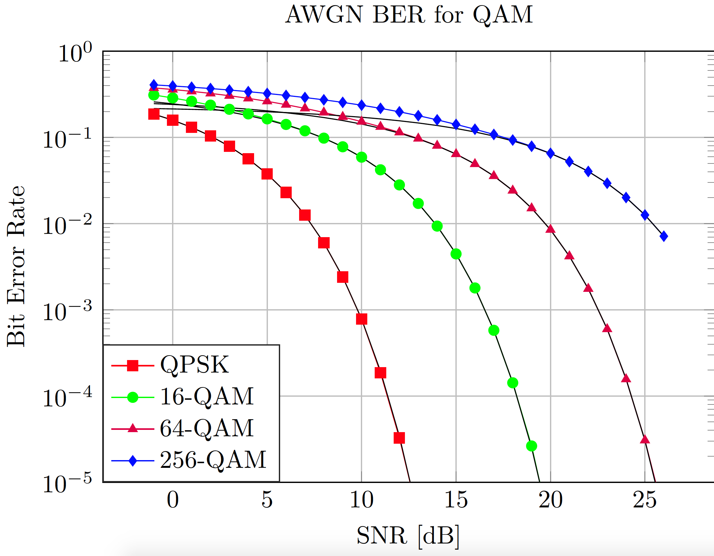

# Compute the theoretical BER for AWGN channel and various constellation size

Based on the previous skeleton, we can now compute an iterative testbench to compute the Bit Error Rate for various constellation size, and compare the simulation with the theory.
As  a gentle reminder, the theoretical bit error rate can be approximated as

``\mathrm{BER} = \frac{ 4 \left( 1 - \frac{1}{\sqrt{M}} \right) }{ \log_2(M)} \times Q( \sqrt{ \frac{6  \log_2(M)}{2(M-1)} \frac{Eb}{N_0}}``

First of all let's call the modules

    using DigitalComm 
    using PGFPlotsX

We define first the main monte-carlo function that compute an elementary Tx-Rx link, and returns the number of error and number of bit computed (to be accumulated)

    function monteCarlo(snr,mcs,nbSymb) 
        # Number of bits  
        nbBits    = nbSymb * Int(log2(mcs));
        # --- Binary sequence generation 
        bitSeq    = genBitSequence(nbBits);
        # --- QPSK mapping
        qamSeq    = bitMappingQAM(mcs,bitSeq);
        # ---------------------------------------------------- 
        # --- Channel  
        # ---------------------------------------------------- 
        #  --- AWGN
        # Theoretical power is 1 (normalized constellation)
        qamNoise,  = addNoise(qamSeq,snr,1);
        # ----------------------------------------------------
        # --- Rx Stage: SRRC
        # ----------------------------------------------------
        # --- Binary demapper
        bitDec  = bitDemappingQAM(mcs,qamNoise);
        # --- Error counter 
        nbE     = sum(xor.(bitDec,bitSeq));
        # --- Return Error and bits 
        return (nbE,nbBits);
    end

A function to plot the BER versus the SNR, for different mcs and compare to theory

    function doPlot(snrVect,ber,qamVect)
        a = 0;
        @pgf a = Axis({
            ymode     = "log",
            height      ="3in",
            width       ="4in",
            grid,
            xlabel      = "SNR [dB]",
            ylabel      = "Bit Error Rate ",
            ymax       = 1,
            ymin       = 10.0^(-5),
            title       = "AWGN BER for QAM",
            legend_style="{at={(0,0)},anchor=south west,legend cell align=left,align=left,draw=white!15!black}"
            },
            Plot({color="red",mark="square*"},Table([snrVect,ber[1,:]])),
            LegendEntry("QPSK"),
            Plot({color="green",mark="*"},Table([snrVect,ber[2,:]])),
            LegendEntry("16-QAM"),

            Plot({color="purple",mark="triangle*"},Table([snrVect,ber[3,:]])),
            LegendEntry("64-QAM"),
            Plot({color="blue",mark="diamond*"},Table([snrVect,ber[4,:]])),
            LegendEntry("256-QAM"),
        );
        # ---  Adding theoretical curve
        snrLin  = (10.0).^(snrVect/10)
        for qamScheme = qamVect
            ebNo    = snrLin / log2(qamScheme);
            # This approximation is only valid for high SNR (one symbol error is converted to one bit error with Gray coding).
            berTheo   = 4 * ( 1 - 1 / sqrt(qamScheme)) / log2(qamScheme) * qFunc.(sqrt.( 2*ebNo * 3 * log2(qamScheme) / (2*(qamScheme-1)  )));
            @pgf push!(a,Plot({color="black"},Table([snrVect,berTheo])));
        end
        display(a);
    end 

Then, the main routine to compute the BER for a given number of iterations and a range of SNR

    function main() 
    # --- Parameters 
    nbIt            = 10000;          # Number of iterations  
    nbSymb          = 1024;           # Number of symbols per iterations 
    mcs             = [4,16,64,256];  # Constellation size 
    snrRange        = (-1:26);        # SNR, expressed in dB 
    # --- Init performance metrics
    nbSNR           = length(snrRange);
    ber             = zeros(Float64,length(mcs),nbSNR);
    for iMcs = 1 : 1  : length(mcs)
        for iSNR = 1 : 1 : nbSNR
            # --- Create BER counters 
            nbE   = 0;
            nbB   = 0;
            for iN = 1 : 1 : nbIt
                # --- Elementary MC call 
                # Corresponds to a given SNR and a given iteration 
                # As we are ergodic in AWGN, it is only nbSymb*nbIt that matters for BER computation
                (a,b) = monteCarlo(snrRange[iSNR],mcs[iMcs],nbSymb); 
                # --- Update counters 
                nbE += a;     # Increment errors 
                nbB += b;     # Increment bit counters 
            end 
            ber[iMcs,iSNR] = nbE / nbB; 
        end
    end 
    # --- Plotting routine
    doPlot(snrRange,ber,mcs);
    end

The output plot is the following, showing adequacy between theory and practise for high SNR (the theoretical curve is under the assumption that one symbol error leads to one erroneous bit (gray coding) which is true only with intermediate noise levels).

