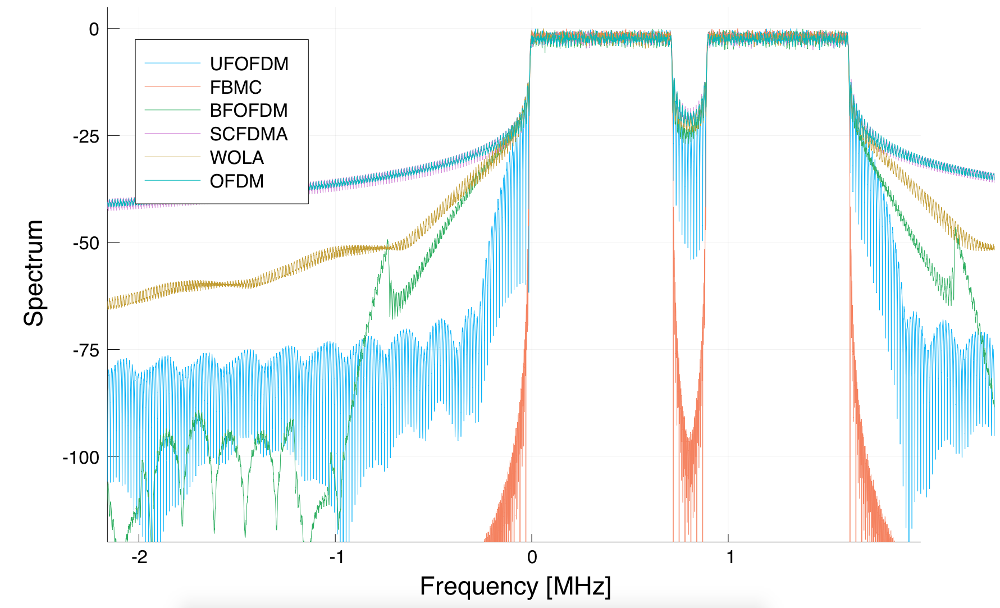

# Plotting PSD of several multicarrier waveforms

The purpose is to compre the Power spectral density of several multicarrier waveform. The following module can be used:

    module example_PSD_waveform 
    # ---------------------------------------------------- 
    # --- Modules  
    # ---------------------------------------------------- 
    using DigitalComm 
    # --- External Modules
    using Plots 
    gr();
    using Printf
    using FFTW
    # ---------------------------------------------------- 
    # --- Core functions  
    # ---------------------------------------------------- 
    """ psdWaveform.m 
    ---  
    Compute the power spectral density (i.e the spectrum here) of the signal parametrized by the waveform structure waveform, for a number of symbol nbSymb.
    The frequency allocation is the one inherited from the waveform structure (i.e waveform.allocatedSubcarriers).
    # --- Syntax 
    ( freq,psd )    = psdWaveform(waveform,nbSymb,allocatedSubcarriers);
    # ---  Input parameters 
    - waveform  : Structure associated to transmitted waveform 
    - nbSymb      : Number of symbol to be transmitted [Int]
    - nbIt    : Monte carlo parameter for PSD evaluation (should be > 1)
    # --- Output parameters 
    - freq    : Vector of frequency evaluation (between -0.5 and 0.5). [Array{Float64,L}]
    - psd     : Spectrum evaluated on freq [Array{Complex{Float64}},L]
    # --- Input parameters 
    - 
    # --- Output parameters 
    - 
    # --- 
    # v 1.0 - Robin Gerzaguet.
    """
    function  psdWaveform(waveform,nbSymb,nbIt)
        # ----------------------------------------------------
        # --- PSD calculation
        # ---------------------------------------------------- 
        # --- Getting frequency allocation 
        allocatedSubcarriers  = waveform.allocatedSubcarriers;
        # --- Getting number of bits 
        # First, frequency size 
        nbSubcarriers         = length(allocatedSubcarriers);
        # Force a fiven mcs 
        mcs                   = 4;    # QPSK.
        # Deduce number of required bits 
        nbBits                = nbSymb * nbSubcarriers * Int(log2(mcs));
        # --- Init psd evaluator 
        psd = 0;
        # --- Iterative PSD calculation
        for iN = 1 : 1 : nbIt
            # --- Binary sequence
            bitSeq        = genBitSequence(nbBits);
            # Mapping
            qamSeq        = bitMappingQAM(mcs,bitSeq);
            # --- T/F matrix
            qamMat        = reshape(qamSeq,nbSubcarriers,nbSymb);
            # --- Signal
            sigPSD        = genSig(qamMat,waveform);
            # --- Mean PSD:
            psd           = psd .+ 1/nbIt*1/length(sigPSD)*abs.(fftshift(fft(sigPSD))).^2;
        end
        # --- Calculating sampling frequency
        # Returns Nyquist frequency 
        fe      = 1;
        Basefe  = (0:(length(psd) .-1))./length(psd)*fe .-fe/2;
        return (Basefe,psd);
    end
    # ---------------------------------------------------- 
    # --- Main routine  
    # ---------------------------------------------------- 
    function main()
        # ----------------------------------------------------
        # --- Overall parameters
        # ----------------------------------------------------
        # --- Overall PHY parameters
        nbIt            = 50;             # --- Iteration number
        nbSymb          = 14;             # --- Number of symbols (one frame)
        nFFT            = 1024;           # --- Base FFT size
        samplingFreq    = 15.36;          # --- Frequency value (MHz)
        # --- Frequency allocation
        #allocatedSubcarriers= getLTEAlloc(nFFT);
        #allocatedSubcarriers = (1:12*4);
        # 4 RB alloc. 1 RB space. 4 RB allocated
        allocatedSubcarriers = [1:12*4; 12*5 .+ (1:12*4)];
        # ----------------------------------------------------
        # --- Waveform contender
        # ----------------------------------------------------
        # --- Init OFDM structure
        ofdm  = initOFDM(
                            nFFT,                           # --- nFFT                 : FFT size
                            72,                             # --- nCP                  : CP size
                            allocatedSubcarriers            # --- allocatedSubcarriers : Subcarrier allocation
                            );
        # --- Init SCFDMA structure
        scfdma  = initSCFDMA(
                                nFFT,                       # --- nFFT                 : FFT size
                                72,                         # --- nCP                  : CP size
                                allocatedSubcarriers,       # --- allocatedSubcarriers : Subcarrier allocation
                                12;                         # --- sizeDFT              : DFT preprocessing size
                                );
        # --- Init UF-OFDM structure
        ufofdm  = initUFOFDM(
                                nFFT,                       # --- nFFT                 : FFT size
                                73,                         # --- L                    : Filter length (same size +1 due to conv)
                                allocatedSubcarriers,       # --- allocatedSubcarriers : Subcarrier allocation
                                applyPD=1,                  # --- applyPD              : Do predistortion at Tx stage
                                attenuation=40,             # --- attenuation          : Filter attenuation in dB
                                );
        # --- Init BF-OFDM structure
        bfofdm  = initBFOFDM(
                                32,                         # --- nFBMC                : PPN size (max number of carriers)
                                64,                         # --- nOFDM                : Precoder size (OFDM sizer)
                                3,                          # --- K                    : Overlapping factor
                                9,                          # --- GI                   : CP size of precoder
                                0.5,                        # --- δ                    : compression factor
                                allocatedSubcarriers,       # --- allocatedSubcarriers : Subcarrier allocation
                                "gaussian",                 # --- filterName           : Pulse shape name
                                BT=0.36,                    # --- BT                   : Potential BT value for Gaussian
                                filterStopBand = 110,       # --- filterStopBand       : DC stopband value
                                fS=[],                      # --- fS                   : Potential frequency coefficient for FS filter
                                nFFT= 1024,                 # --- nFFT                 : associated FFT value in Rx
                                nCP= 72,                    # --- nCP                  : extended CP size
                                );
        # --- Init WOLA-OFDM structure
        wola  = initWOLA(
                            nFFT,                           # --- nFFT                 : FFT size
                            72,                             # --- nCP                  : CP size
                            allocatedSubcarriers,           # --- allocatedSubcarriers : Subcarrier allocation
                            "triangle",                     # --- Window type @Tx side
                            20,                             # --- Window size @Tx side
                            "triangle",                     # --- Window type @Rx side
                            20,                             # --- Window size @Rx side
                            );
        fbmc  = initFBMC(
                            nFFT,                           # --- nFFT                 : FFT size
                            4,                              # --- K                    : Overlapping factor
                            allocatedSubcarriers            # --- allocatedSubcarriers : Subcarrier allocation
                            );
        # ----------------------------------------------------
        # --- Merging structures
        # ----------------------------------------------------
        # Create  a dictionnary to rule them all 
        waveforms   = initWaveforms(ofdm,
                                    scfdma,
                                    ufofdm,
                                    bfofdm,
                                    wola,
                                    fbmc,
                                    );
        # ---------------------------------------------------- 
        # --- PSD main calculation  
        # ---------------------------------------------------- 
        # --- Init plot container 
        plt     = plot(reuse=false);
        decim   = 1;    # decimation for light plots
        # --- Iterative PSD generation
        for (name,struc) in waveforms 
            # --- Calculate PSD for the configuration 
            (fe,psd)  = psdWaveform(struc,nbSymb,nbIt); 
            # Plot the result 
            plot!(plt,fe[1:decim:end].*samplingFreq,10 .* log10.(psd[1:decim:end]/maximum(psd)),label=name,legend=:topleft);
        end
        # --- Update plot and adding labels 
        # Purpose is to zoom out on allocated region.
        scsN        = (1/1024)*samplingFreq;    # Subscarrier spacing (normalized)
        rbV         = (12*12);                  # See several RB for psd fall-off
        ylims!(-120,5);
        xlims!(-rbV*scsN,maximum(allocatedSubcarriers)*scsN+2*12*scsN);
        xlabel!("Frequency [MHz]");
        ylabel!("Spectrum");
        display(plt)
    end
    end

By running `example_PSD_waveform.main();` a comparison plot between the different PSD can be obtained

